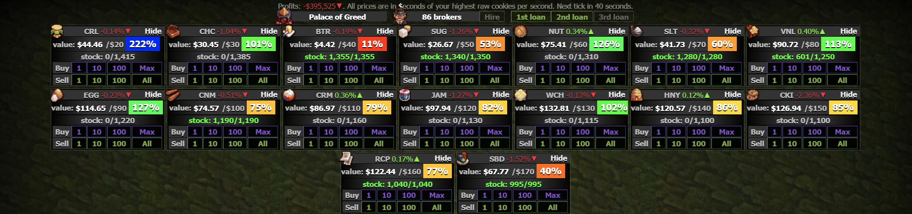

# Cookie-Stonks

Cookie Clicker Stock Market Helper

# Description
Quick script that displays the [Resting Value](https://cookieclicker.fandom.com/wiki/Stock_Market) (Every minute, the value of each stock is gradually shifted toward this value by 2%) and the percentage value of the stock price at the moment corresponding with its resting value (if the price of the stock atm = resting value of the stock, percentage = 100%).


> Resting Value = 10 x (Stock Id + 1) + Bank Level - 1

# Installation

## Browser

### Userscript Manager _(Recommended)_

1. If you don't have a user script manager, install one first. For Mozilla Firefox, get [Greasemonkey](https://addons.mozilla.org/firefox/addon/greasemonkey/). For Google Chrome or Edge, [Tampermonkey](https://chrome.google.com/webstore/detail/tampermonkey/dhdgffkkebhmkfjojejmpbldmpobfkfo) is the one you need.

2. In this page, click on [main.js](main.js). A new page will load showing its code. Click on the **Raw** button.

3. Your user script manager will prompt you to confirm the installation.

### Bookmark _(Needs to be manually opened each time)_

1. Add a new bookmark with whatever name you want and paste this as the URL:
```
javascript:(function(){var script=document.createElement('script');script.setAttribute('type','text/javascript');script.setAttribute('src','https://combinatronics.com/worldwidewaves/Cookie-Stonks/main/main.js');document.body.appendChild(script);}());
```
2. Open Cookie Clicker and click on the bookmark.

## Steam

### Workshop  _(Recommended)_

1. Go to the [Workshop Page](https://steamcommunity.com/sharedfiles/filedetails/?id=2767659541) and click subscribe.

### Manual

1. Open the mods folder. You can locate the folder ingame by clicking on **Options** → **Manage mods** → **Open /mods folder**.

2. Open the **local** folder and create a new folder, give it the name **Cookie Stonks**.

3. Download the two files [main.js](main.js) & [info.txt](info.txt) on this page and put them inside the **Cookie Stonks** folder you created.  
Alternatively, create an **info.txt** and **main.js** file in the **Cookie Stonks** folder, then copy the contents of the [main.js](main.js) & [info.txt](info.txt) files into them, respectively. Note that you need to have file name extensions turned on if you wish to do it this way.
